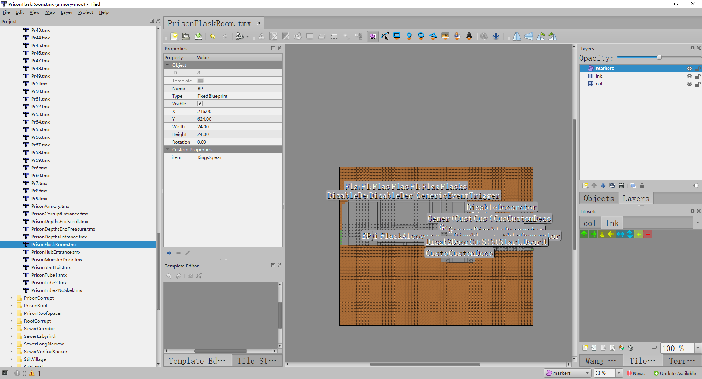
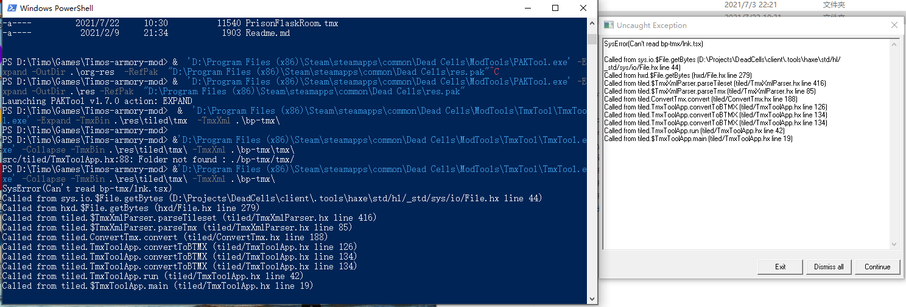
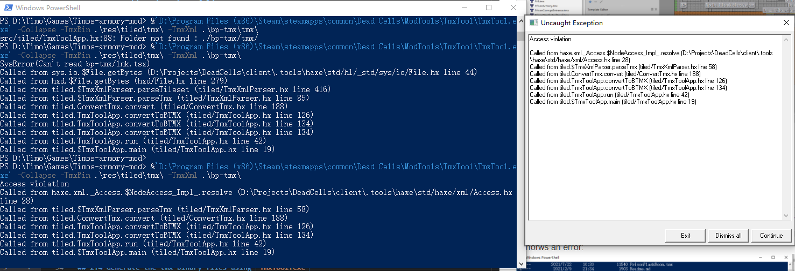

TmxTool bug description by Timo
=======================

## 1. Environment
OS: Windowns 10 21H1   
Dead cells: V2.4.3 (2021-07-01 - 701087d19a)  
Tiled: 1.4.0  
Modding documentation that I followed: `D:\Program Files (x86)\Steam\steamapps\common\Dead Cells\ModTools\ModsDoc.pdf`  

## 2. Exact steps to reproduce the error
The following commands are called under Powershell. 
### 2.1 Unpacking the pak to folder
Destination folder: `res`  
```PowerShell
&  'D:\Program Files (x86)\Steam\steamapps\common\Dead Cells\ModTools\PAKTool.exe' -Expand -OutDir .\res -RefPak  "D:\Program Files (x86)\Steam\steamapps\common\Dead Cells\res.pak"
```
Command output:  
```
Launching PAKTool v1.7.0 action: EXPAND
```
### 2.2 Generating the tmx xml files from the binary files   
Destination folder: `bp-tmx`  
```PowerShell
 &  'D:\Program Files (x86)\Steam\steamapps\common\Dead Cells\ModTools\TmxTool\TmxTool.exe' -Expand -TmxBin .\res\tiled\tmx  -TmxXml .\bp-tmx\
```
Command has no output.  

### 2.3 Modify the `PrisonFlaskRoom.tmx` using Tiled 1.4.0.   
Destination folder: `bp-tmx` 
Change file: `bp-tmx\Prison\PrisonFlaskRoom.tmx`  
Changes that I made: Add a blueprint to the left of `NPC` somewhere (Using `Marker`). See the following picture.  


## 2.4 Generate the tmx binary files using `TmxTool.exe`
Destination folder: `res\tiled\tmx`  
(1) First try:
```PowerShell
&'D:\Program Files (x86)\Steam\steamapps\common\Dead Cells\ModTools\TmxTool\TmxTool.exe' -Collapse -TmxBin .\res\tiled\tmx\ -TmxXml .\bp-tmx\
```
It thorws an error:  


Solution: Copy `col.tsx` and `lnk.tsx` to folder `bp-tmx`.  
(2) Second try:
```PowerShell
&'D:\Program Files (x86)\Steam\steamapps\common\Dead Cells\ModTools\TmxTool\TmxTool.exe' -Collapse -TmxBin .\res\tiled\tmx\ -TmxXml .\bp-tmx\
```
It throws the `Access violation ` error.
Command output:
```
Access violation
Called from haxe.xml._Access.$NodeAccess_Impl_.resolve (D:\Projects\DeadCells\client\.tools\haxe\std/haxe/xml/Access.hx line 28)
Called from tiled.$TmxXmlParser.parseTmx (tiled/TmxXmlParser.hx line 58)
Called from tiled.ConvertTmx.convert (tiled/ConvertTmx.hx line 188)
Called from tiled.TmxToolApp.convertToBTMX (tiled/TmxToolApp.hx line 126)
Called from tiled.TmxToolApp.convertToBTMX (tiled/TmxToolApp.hx line 134)
Called from tiled.TmxToolApp.run (tiled/TmxToolApp.hx line 42)
Called from tiled.$TmxToolApp.main (tiled/TmxToolApp.hx line 19)
```
  


